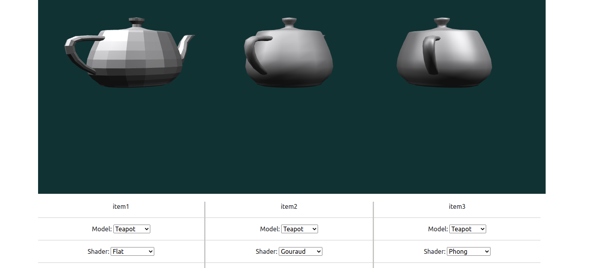

# ICG - Homework 1

> Author: Kin Fong, Chao  
> Student ID: B08902087

## How to run my code
  First, you need to install [Visual Studio Code](https://code.visualstudio.com/) and its extension [Live server](https://marketplace.visualstudio.com/items?itemName=ritwickdey.LiveServer). And then, use Visual Studio Code open my working directory (```B08902087_hw1```), then click the "Go Live" button from the status bar to turn the server on, like the following screenshot.
  
  After that, it will open your brower and you have run my code :). And then result will be like the following screenshot.
  